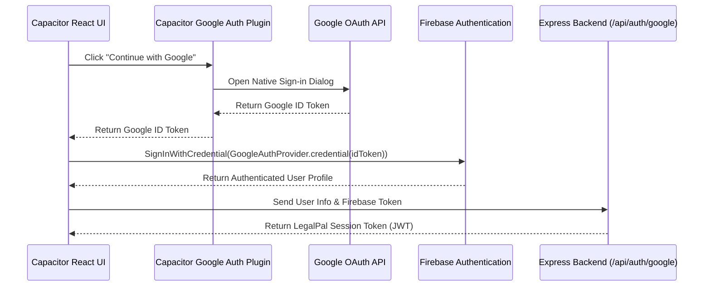
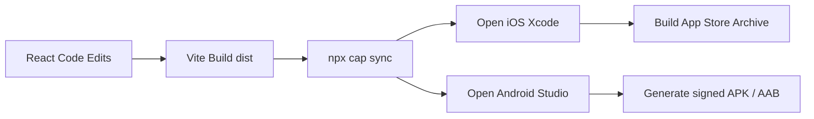

# Implementation Plan: Mobile App Transition for LegalPal 📱⚖️

Transforming the **LegalPal** React + Vite website into a high-performance, installable mobile application on the Apple App Store and Google Play Store, while preserving premium assets like Three.js dynamic particle backgrounds, Framer Motion animations, and real-time Socket.io virtual courtroom engines.

---

## 🏗️ Architecture & Technology Selection

To achieve the best mobile experience without rewriting the core interface, **Capacitor** is selected as the primary wrapper, with an optional, parallel **Progressive Web App (PWA)** framework for immediate web installations.

### Technology Blueprint Comparison

| Aspect | Capacitor (Native Shell) | React Native (Fully Native UI) | PWA (Progressive Web App) |
| :--- | :--- | :--- | :--- |
| **Code Reuse** | **100%** (Reuses Vite build output) | **~30%** (Rewrite UI elements to native) | **100%** (Uses standard web builds) |
| **3D Rendering** | **Excellent** (Uses native Chrome/Safari WebGL) | **Complex** (Requires Canvas bridging) | **Excellent** (Browser standard) |
| **Realtime Sockets** | **Supported natively** via web socket bridging | **Supported natively** | **Supported natively** |
| **Distribution** | Apple App Store & Google Play Store | Apple App Store & Google Play Store | Web Browser "Add to Home Screen" |
| **Native APIs** | Plugins (Camera, Haptics, Push, Storage) | Built-in native hooks | Restricted browser APIs |

```mermaid
graph TD
    subgraph Mobile App (iOS / Android Device)
        A[Native App Shell] --> B[Capacitor Native Bridge]
        B --> C[Vite Production Build in WebView]
        C -- Uses http://localhost / capacitor://localhost --> D[Styled-Components UI]
        C -- Three.js 3D Particles --> E[WebGL Canvas]
        C -- Native Plugin API calls --> B
    end
    subgraph Backend Cloud Server (Hosted)
        F[Node.js + Express Server]
        G[MongoDB Database]
        H[Socket.io Realtime Server]
    end
    C -- CORS-Approved HTTPS Requests --> F
    C -- WebSocket connection --> H
    F --> G
```

---

## 🛠️ Step-by-Step Implementation Roadmap

---

### Phase 1: Preparing the React Web App for Mobile Viewports
Before packaging, the React UI must adapt fully to native phone constraints, specifically addressing viewport height changes and notch-safe areas.

#### 1. Dynamic Mobile Heights (`dvh` and safe areas)
Mobile browsers and webviews have dynamic bars that trigger scroll jitter when using standard `100vh`. Styled-components must strictly map container heights using `100dvh` (Dynamic Viewport Height).

*   Update standard layouts to respect phone notches using CSS safe-area constants. Add the following meta tag in `client/index.html`:
    ```html
    <meta name="viewport" content="width=device-width, initial-scale=1.0, viewport-fit=cover">
    ```
*   Incorporate safe-area padding-top and padding-bottom rules in core layout pages to keep content from getting clipped by device notches and bottom system swipe bars:
    ```css
    padding-top: env(safe-area-inset-top, 20px);
    padding-bottom: env(safe-area-inset-bottom, 20px);
    ```

---

### Phase 2: Resolving API Requests & Native CORS (Crucial)
In the native app environment, relative endpoints (like `/api/...` or `/uploads/...`) will fail because there is no hosting web dev server to proxy requests. Webviews load files from standard device systems.

#### 1. Decouple Axios from Vite Web Proxy
We must update the Axios client to dynamically switch between the local proxy for browser development and absolute endpoints for the native app:

```diff
- // client/src/utils/axios.js
- const instance = axios.create({
-     baseURL: '/', // Vite proxy handles /api requests to localhost:5000
-     headers: {
-         'Content-Type': 'application/json'
-     }
- });

+ // client/src/utils/axios.js
+ const API_BASE_URL = import.meta.env.VITE_API_URL || ''; // dynamic override
+ const instance = axios.create({
+     baseURL: API_BASE_URL,
+     headers: {
+         'Content-Type': 'application/json'
+     }
+ });
```

#### 2. Backend CORS Configuration Update
Capacitor WebViews send dynamic origins rather than empty headers when executing AJAX requests:
- **Android WebView Origin:** `http://localhost`
- **iOS WebView Origin:** `capacitor://localhost`

If your backend is not configured to accept these custom protocols, all login, chat, and document uploads will fail due to CORS browser blocks. 

```diff
// server/config/cors.js
const allowedOrigins = [
    'http://localhost:5000',
    'http://localhost:3000',
    'http://localhost:5173',
    'http://localhost:5174',
    'http://localhost:5175',
    'http://localhost:5176',
-   'http://localhost:5188'
+   'http://localhost:5188',
+   'http://localhost',          // Capacitor Android native origin
+   'capacitor://localhost'      // Capacitor iOS native origin
];
```

> [!WARNING]
> While a mobile developer might be tempted to use `*` (any origin) in their CORS setup, doing so is highly insecure and will fail if `credentials: true` is set, which LegalPal relies on for session management. You must explicitly list `http://localhost` and `capacitor://localhost` in the allowed list!

---

### Phase 3: Firebase Auth Platform Bridging (OAuth Mobile Fix)
Firebase Web SDK's `signInWithPopup(auth, googleProvider)` will fail inside a mobile WebView because there is no valid redirect domain handler.



To resolve this, we will write a platform-aware auth redirect strategy:
1. **On Desktop/Web/PWA:** Use the current Firebase Web standard popup interface.
2. **On Mobile (Capacitor):** Use the official `@capacitor-community/google-auth` plugin to retrieve a native ID token, then exchange it using Firebase credentials.

```javascript
// Example platform-aware login handler in client/src/pages/Auth/LoginSignupPage.jsx
import { Capacitor } from '@capacitor/core';
import { GoogleAuth } from '@capacitor-community/google-auth';
import { signInWithCredential, GoogleAuthProvider } from 'firebase/auth';

const handleGoogleLogin = async () => {
    if (Capacitor.isNativePlatform()) {
        // Native Google Authentication
        const user = await GoogleAuth.signIn();
        const credential = GoogleAuthProvider.credential(user.authentication.idToken);
        const result = await signInWithCredential(auth, credential);
        await proceedWithBackendAuth(result.user);
    } else {
        // Web Popup Firebase Auth (Existing Flow)
        const result = await signInWithPopup(auth, googleProvider);
        await proceedWithBackendAuth(result.user);
    }
};
```

---

### Phase 4: Installing & Initializing Capacitor.js

Run the following commands strictly inside the `/client` directory (where Vite is configured):

```bash
# 1. Install Capacitor Core, CLI and platform drivers
npm install @capacitor/core @capacitor/cli @capacitor/ios @capacitor/android

# 2. Initialize Capacitor configuration (Enter App Name: "LegalPal", Package ID: "com.legalpal.app")
npx cap init

# 3. Add Android and iOS platforms
npx cap add android
npx cap add ios
```

#### Update `client/capacitor.config.json` (or `capacitor.config.ts`)
Set the web build folder target to match Vite's build directory (`dist`):

```json
{
  "appId": "com.legalpal.app",
  "appName": "LegalPal",
  "webDir": "dist",
  "bundledWebRuntime": false,
  "server": {
    "androidScheme": "http",
    "iosScheme": "capacitor"
  }
}
```

---

### Phase 5: Parallel Progressive Web App (PWA) Configuration
To allow immediate mobile installation straight from the web browser, add the lightweight, powerful Vite PWA plugin.

#### 1. Install PWA Plugin
Inside `/client`:
```bash
npm install vite-plugin-pwa --save-dev
```

#### 2. Configure `client/vite.config.js`
Update Vite's configuration to inject the service worker and app manifest:

```javascript
import { defineConfig } from 'vite'
import react from '@vitejs/plugin-react'
import { VitePWA } from 'vite-plugin-pwa'

export default defineConfig({
  plugins: [
    react(),
    VitePWA({
      registerType: 'autoUpdate',
      includeAssets: ['favicon.ico', 'apple-touch-icon.png', 'masked-icon.svg'],
      manifest: {
        name: 'LegalPal AI Companion',
        short_name: 'LegalPal',
        description: 'Premium AI Legal Companion',
        theme_color: '#0f111a',
        background_color: '#0f111a',
        display: 'standalone',
        orientation: 'portrait',
        icons: [
          {
            src: 'pwa-192x192.png',
            sizes: '192x192',
            type: 'image/png'
          },
          {
            src: 'pwa-512x512.png',
            sizes: '512x512',
            type: 'image/png'
          }
        ]
      }
    })
  ]
})
```

---

### Phase 6: Adding Native Device Integrations (Capacitor Plugins)
Make the packaged web app feel truly native by introducing micro-haptics and standard platform overlays:

```bash
# Add Native Haptics (Vibrations when winning courtroom battles or using AI features)
npm install @capacitor/haptics

# Add Keyboard handling (Prevent overlay bugs when typing in chat bar)
npm install @capacitor/keyboard

# Add Splash Screen (For smooth loading experiences)
npm install @capacitor/splash-screen
```

*   **Keyboard Layout Management:** In `client/capacitor.config.json`, add rules to automatically resize the webview when the soft mobile keyboard is invoked, ensuring the chat bar scrolls up beautifully:
    ```json
    "plugins": {
      "Keyboard": {
        "resize": "body",
        "style": "dark"
      }
    }
  ```

---

### Phase 7: Building, Syncing, and Packaging



Run these steps whenever you make changes to the React code:

```bash
# 1. Compile the React + Vite frontend code into static build files
npm run build --workspace=@lawyer-ai/client

# 2. Copy the production build folder into your native mobile structures
npx cap sync

# 3. Open your mobile compilers (IDE)
npx cap open android   # Launches Android Studio
npx cap open ios       # Launches Xcode
```

---

## 📋 Pre-Deployment Checklists

### 🍏 iOS (Xcode)
1. **Developer Program:** Ensure you have an active Apple Developer Account ($99/year).
2. **Icons:** Use Capacitor's `cordova-res` to auto-generate all app icons & splash screens from one base image.
3. **Privacy Keys:** Inside Xcode `Info.plist`, append descriptive usage reasons for plugins:
    - `NSCameraUsageDescription` (e.g., "LegalPal requires camera access to scan physical legal documents.")
    - `NSPhotoLibraryUsageDescription` (e.g., "LegalPal requires file access to upload court briefs.")

### 🤖 Android (Android Studio)
1. **Developer Account:** Setup a Google Play Developer console account ($25 one-time fee).
2. **Signing Key:** Create a secure release Keystore file inside Android Studio.
3. **App Bundle:** Generate a release Android App Bundle (`.aab`) instead of `.apk` to optimize the final download size for mobile users.
